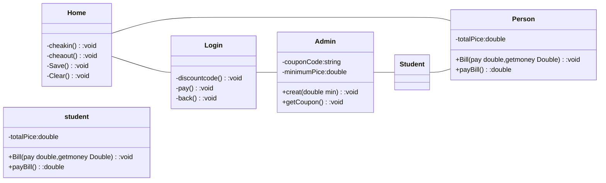

ความเป็นมา
```
    เนื่องจากว่าห้องโปรมีคนเข้าใช้เป็นจำนวนมาก แต่ไม่สามารถรู้ได้ว่าใครเข้าใช้บ้าง จึงสร้างโปรแกรมนี้ขึ้นมา
```
วัตถุประสงค์ของโปรแกรม
```
    อยากรู้ว่าใครใช้บ้างโดยให้บอก ชื่อ นามสกุล สาขา และชั้นปี
```
Class Diagram

ชื่อผู้พัฒนา
```
นางสาว ชฎาพร พินิจสัย
```